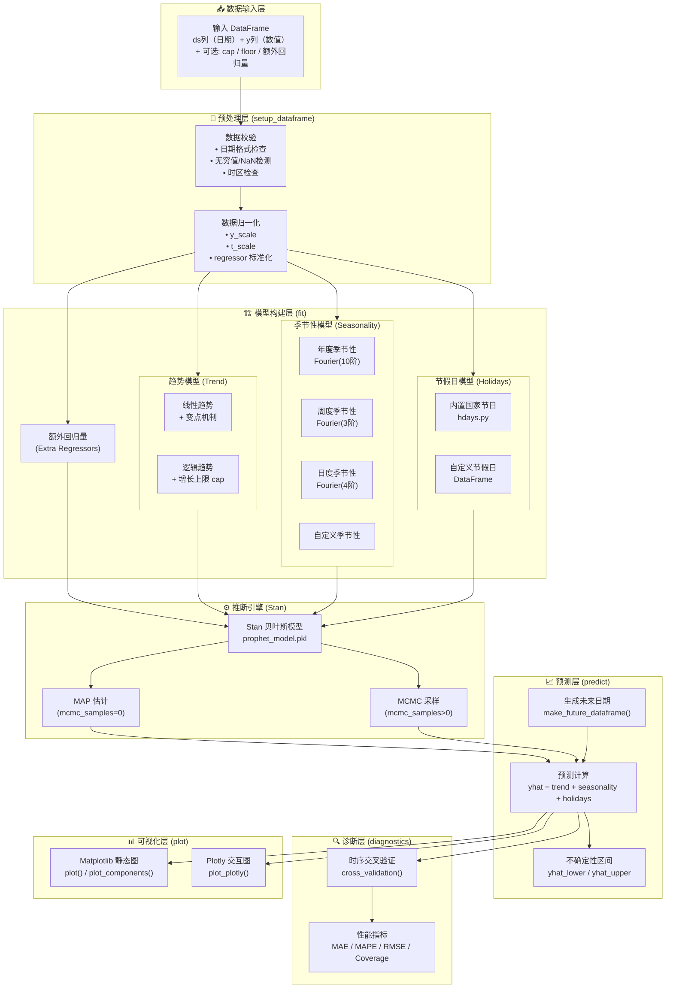
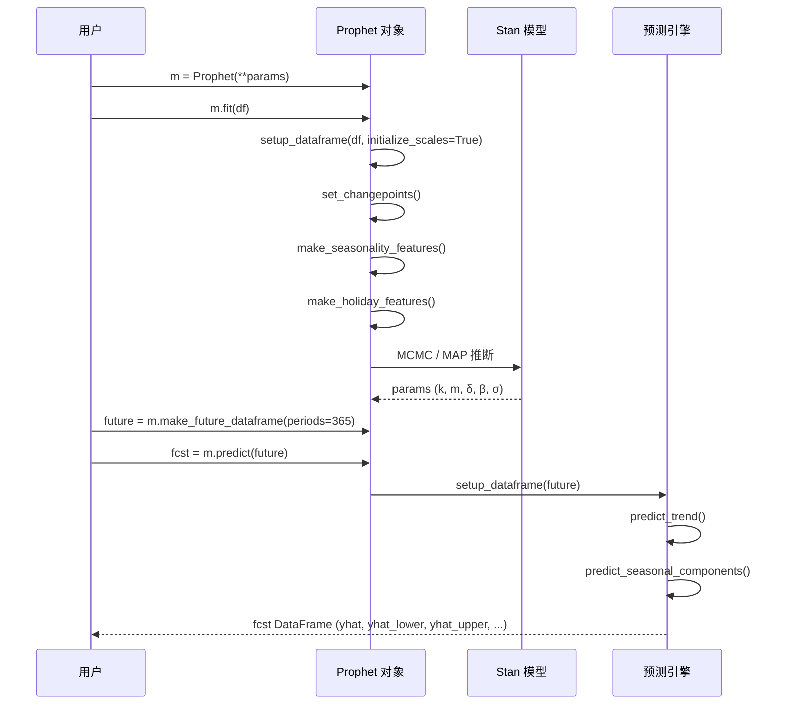
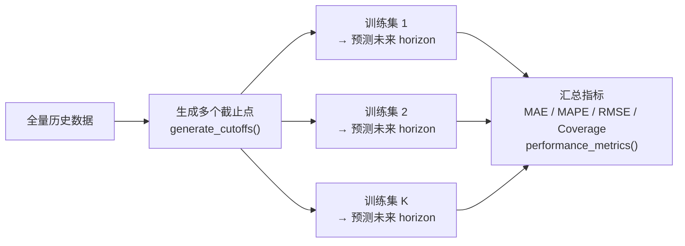

# Prophet 核心架构文档报告

> **项目**：Facebook Prophet — 自动时间序列预测框架  
> **版本**：0.5  
> **语言**：Python / R  
> **文档日期**：2026-04-14

---

## 一、项目概述

Prophet 是由 Facebook Core Data Science 团队开源的时间序列预测工具，基于**加法模型**（Additive Model）对时间序列进行分解与预测。它适用于具有强季节性规律和多年历史数据的业务场景，对缺失值和异常值有较好的鲁棒性。

### 核心特性

| 特性 | 说明 |
|------|------|
| 趋势模型 | 线性增长（linear）或逻辑增长（logistic） |
| 季节性 | 年度 / 周度 / 日度，支持自定义傅里叶阶数 |
| 节假日效应 | 内置 100+ 国家节日，支持自定义 |
| 变点检测 | 自动或手动指定趋势变点（changepoints） |
| 贝叶斯推断 | 底层使用 Stan，支持 MAP 或 MCMC 采样 |
| 不确定性估计 | 预测区间基于后验采样 |
| 额外回归量 | 支持添加外部特征变量 |

---

## 二、整体系统架构图



---

## 三、模块文件结构

```
prophet/
├── python/
│   ├── fbprophet/
│   │   ├── forecaster.py      # 核心类 Prophet，fit/predict 主逻辑
│   │   ├── diagnostics.py     # 交叉验证、性能指标计算
│   │   ├── plot.py            # Matplotlib + Plotly 绘图函数
│   │   ├── make_holidays.py   # 节假日数据生成工具
│   │   ├── hdays.py           # 内置各国节假日定义
│   │   ├── models.py          # 加载预编译 Stan 模型
│   │   └── tests/
│   │       ├── test_prophet.py      # 核心功能测试
│   │       └── test_diagnostics.py  # 诊断模块测试
│   ├── requirements.txt
│   └── setup.py
├── R/                         # R 语言实现（与 Python 功能对等）
├── docs/                      # 文档（Jekyll 静态站点）
├── notebooks/                 # Jupyter 示例笔记本
├── examples/                  # 示例数据与脚本
└── stan/                      # Stan 贝叶斯模型源码
```

---

## 四、加法模型数学公式

Prophet 将时间序列分解为：

```
y(t) = trend(t) + seasonality(t) + holidays(t) + ε(t)
```

### 4.1 趋势模型

**线性增长（分段线性）**：
```
trend(t) = (k + a(t)ᵀδ) · t + (m + a(t)ᵀγ)
```
- `k`：基础增长率
- `δ`：变点处的增长率调整量
- `m`：基础偏移量

**逻辑增长（Logistic）**：
```
trend(t) = L / (1 + exp(-k(t - m)))
```
- `L`：增长上限（cap）

### 4.2 季节性模型（傅里叶级数）

```
seasonality(t) = Σ [aₙcos(2πnt/P) + bₙsin(2πnt/P)]
```
- `P`：周期（年=365.25，周=7）
- `N`：傅里叶阶数

### 4.3 变点检测


---

## 五、数据流详解



---

## 六、交叉验证架构



---

## 七、类与函数速查

### Prophet 主类关键方法

| 方法 | 功能 |
|------|------|
| `fit(df)` | 拟合模型（调用 Stan 推断） |
| `predict(future)` | 生成预测结果 |
| `make_future_dataframe(periods, freq)` | 生成未来时间索引 |
| `add_seasonality(name, period, fourier_order)` | 添加自定义季节性 |
| `add_regressor(name)` | 添加额外回归变量 |
| `add_country_holidays(country_name)` | 添加国家节假日 |
| `plot(fcst)` | 绘制预测图 |
| `plot_components(fcst)` | 绘制分量图 |

### diagnostics 模块

| 函数 | 功能 |
|------|------|
| `cross_validation(model, horizon, period, initial)` | 时序交叉验证 |
| `performance_metrics(df, metrics, rolling_window)` | 计算评估指标 |
| `plot_cross_validation_metric(df_cv, metric)` | 可视化交叉验证指标 |

---

## 八、LLM 智能分析集成

本仓库提供了 `python/llm_analysis.py`，利用 LLM（大语言模型）对 Prophet 预测结果进行智能解读：

- **自动趋势解读**：识别趋势方向、变点时间节点及业务含义
- **季节性解读**：分析周度/年度规律并给出业务解释
- **异常检测解读**：对节假日效应和残差异常做自然语言说明
- **预测置信度评估**：对不确定性区间给出风险评估建议

> 详见 [`python/llm_analysis.py`](../python/llm_analysis.py)

---

## 九、快速开始

```python
from fbprophet import Prophet
import pandas as pd

# 1. 准备数据（ds + y 两列）
df = pd.read_csv('data.csv')
df['ds'] = pd.to_datetime(df['ds'])

# 2. 创建并训练模型
m = Prophet(
    changepoint_prior_scale=0.05,
    yearly_seasonality=True,
    weekly_seasonality=True,
)
m.add_country_holidays(country_name='CN')
m.fit(df)

# 3. 预测未来 365 天
future = m.make_future_dataframe(periods=365)
fcst = m.predict(future)

# 4. 可视化
fig = m.plot(fcst)
fig2 = m.plot_components(fcst)

# 5. LLM 智能分析（需配置 API Key）
from llm_analysis import ProphetLLMAnalyzer
analyzer = ProphetLLMAnalyzer(model="gpt-4o")
report = analyzer.analyze(m, fcst)
print(report)
```

---

*本文档由 `docs/architecture_report.md` 维护，架构图使用 Mermaid 语法，在 GitHub 上可直接渲染预览。*
